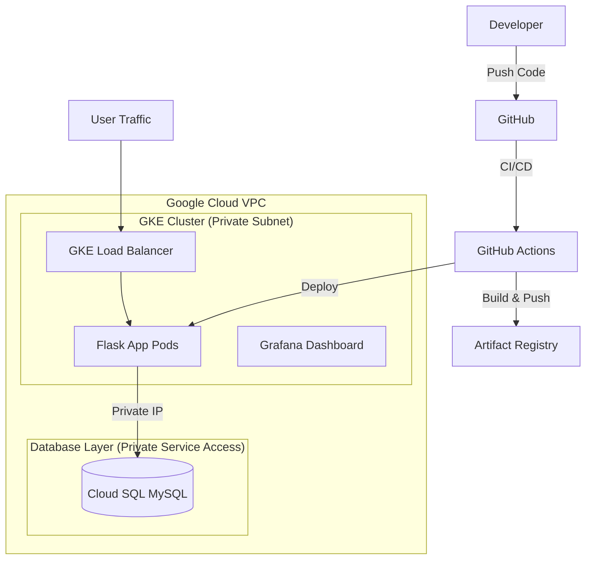
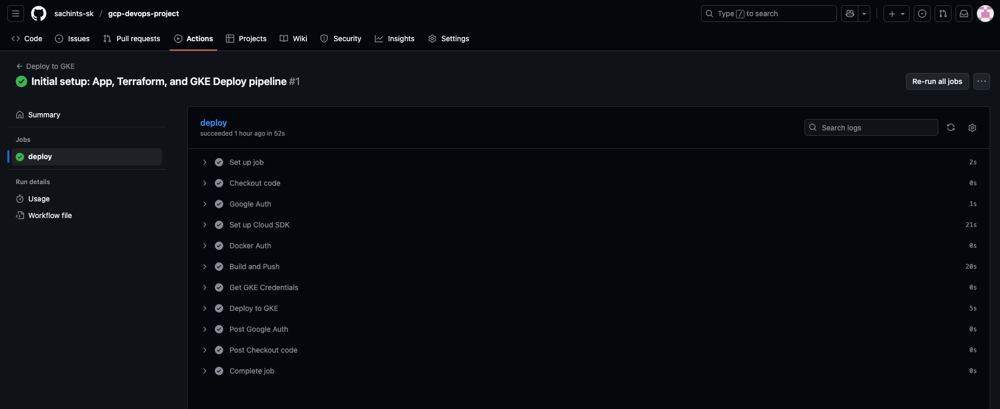

# Secure Three-Tier DevOps Architecture on Google Cloud (GKE)


## 📋 Project Overview
This project demonstrates a production-ready **DevSecOps pipeline** deployed on Google Cloud Platform. It features a **Three-Tier Architecture** (Frontend/API, Backend Logic, Database) fully automated using **Infrastructure as Code (Terraform)** and **GitHub Actions**.

The core objective is to implement strong security practices—specifically **Network Isolation** using VPC Peering—and robust **Observability** through Grafana integrated with Google Cloud Monitoring (SLIs/SLOs).

---

## 🏗️ Architecture
The infrastructure is provisioned via Terraform and includes:

1. **VPC Network:** Custom VPC with private subnets.
2. **GKE Cluster:** VPC-native Kubernetes cluster.
3. **Cloud SQL:** MySQL instance with **Private Service Access** (no public exposure).
4. **Observability:** Grafana Pod visualizing Cloud Monitoring metrics.



---

## 🛠️ Tech Stack
| Category | Technologies |
|----------|--------------|
| Cloud Provider | Google Cloud Platform |
| Orchestration | Google Kubernetes Engine |
| Infrastructure as Code | Terraform (State stored in GCS) |
| CI/CD | GitHub Actions |
| Containerization | Docker, Artifact Registry |
| Database | Cloud SQL (MySQL 8.0) |
| Observability | Grafana, Google Cloud Monitoring |
| Application | Python (Flask), PyMySQL |

---

## 🚀 Key Features
### 1. Infrastructure as Code (Terraform)
- **Remote State:** All state is stored in a GCS bucket for collaboration.
- **Networking:** Implemented `google_service_networking_connection` for VPC Peering—GKE Pods connect to Cloud SQL privately.

### 2. CI/CD Pipeline (GitHub Actions)
- **Dynamic Tagging:** Manifest templates are updated on-the-fly with the new Docker image tag.
- **Secret Management:** Uses Kubernetes Secrets—not hardcoded credentials.
- **Zero-Downtime Deployments:** Rolling updates keep services online.

### 3. Observability
- **Grafana Deployment:** Runs inside the cluster as a monitoring layer.
- **SLIs:** Metrics include CPU, Memory, Pod Restarts, API Latency.

---

## 📂 Project Structure
```
├── .github/workflows
│   └── deploy.yml       # CI/CD Pipeline
├── app
│   ├── Dockerfile
│   ├── main.py          # Flask App
│   └── requirements.txt
├── k8s
│   ├── deployment.yaml  # App + Service
│   └── grafana.yaml     # Monitoring
├── terraform
│   ├── main.tf          # VPC, GKE, SQL
│   ├── providers.tf
│   └── outputs.tf
└── README.md
```

---


## 📊 Screenshots

### GitHub Actions Pipeline


---

## 👤 Author
**Sachin T.S**


---

